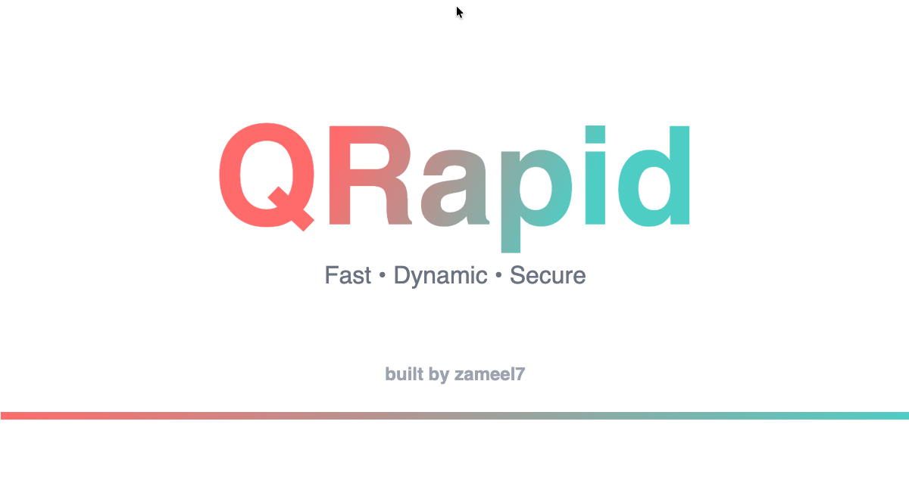

<p align="center">
  
</p>

# QRapid

**Fast • Dynamic • Secure** - A modern QR code generator for business and personal use.

## ✨ Features

- **Static QR Codes** - Generate permanent QR codes that point directly to your URL
- **Dynamic QR Codes** - Create updatable QR codes with scan tracking and analytics
- **Scan Analytics** - Track how many times your dynamic QR codes are scanned
- **Instant Generation** - Generate QR codes in seconds with a clean, intuitive interface
- **Download & Share** - Download your QR codes as PNG images for printing or digital use
- **User Authentication** - Secure Google Sign-In to manage your QR codes
- **Subscription System** - Flexible plans for different usage needs

## 🛠 Tech Stack

- **Framework**: [Next.js 16](https://nextjs.org/) with App Router
- **Language**: TypeScript
- **Authentication**: Firebase Auth (Google Sign-In)
- **Database**: Cloud Firestore
- **QR Generation**: [qrcode](https://www.npmjs.com/package/qrcode)
- **Icons**: [Remix Icons](https://remixicon.com/)
- **Styling**: CSS Modules

## 🚀 Getting Started

### Prerequisites

- Node.js 18+ 
- npm, yarn, pnpm, or bun
- Firebase project with Auth and Firestore enabled

### Installation

1. Clone the repository:
   ```bash
   git clone https://github.com/zameel7/qrcodegen.git
   cd qrcodegen
   ```

2. Install dependencies:
   ```bash
   npm install
   # or
   yarn install
   # or
   pnpm install
   ```

3. Set up environment variables:
   
   Create a `.env.local` file in the root directory:
   ```env
   NEXT_PUBLIC_FIREBASE_API_KEY=your_api_key
   NEXT_PUBLIC_FIREBASE_AUTH_DOMAIN=your_auth_domain
   NEXT_PUBLIC_FIREBASE_PROJECT_ID=your_project_id
   NEXT_PUBLIC_FIREBASE_STORAGE_BUCKET=your_storage_bucket
   NEXT_PUBLIC_FIREBASE_MESSAGING_SENDER_ID=your_sender_id
   NEXT_PUBLIC_FIREBASE_APP_ID=your_app_id
   NEXT_PUBLIC_BASE_URL=http://localhost:3000
   ```

4. Run the development server:
   ```bash
   npm run dev
   # or
   yarn dev
   # or
   pnpm dev
   ```

5. Open [http://localhost:3000](http://localhost:3000) in your browser.

## 📁 Project Structure

```
qrcodegen/
├── public/
│   ├── favicon.ico
│   ├── logo.png
│   └── og-image.png
├── src/
│   ├── app/
│   │   ├── dashboard/       # Main dashboard page
│   │   ├── go/[id]/         # Dynamic QR redirect handler
│   │   ├── login/           # Authentication page
│   │   ├── plan/            # Subscription plans
│   │   ├── qr/[id]/         # QR code viewer
│   │   ├── globals.css
│   │   ├── layout.tsx
│   │   └── page.tsx         # Landing page
│   ├── components/
│   │   ├── QRGenerator.tsx  # QR code generation component
│   │   └── QRHistory.tsx    # User's QR code history
│   ├── contexts/
│   │   └── AuthContext.tsx  # Authentication context
│   └── lib/
│       └── firebase.ts      # Firebase configuration
├── firestore.rules
├── package.json
└── tsconfig.json
```

## 📱 Static vs Dynamic QR Codes

| Feature | Static QR | Dynamic QR |
|---------|-----------|------------|
| URL Change | ❌ No | ✅ Yes |
| Scan Tracking | ❌ No | ✅ Yes |
| Redirect | Direct | Through QRapid |
| Use Case | Permanent links | Marketing, campaigns |

## 🔒 Firebase Security Rules

The project uses Firestore security rules (`firestore.rules`) to ensure users can only access their own QR codes. Make sure to deploy these rules to your Firebase project.

## 📄 License

This project is open source and available under the [MIT License](LICENSE).

## 🙏 Acknowledgments

- Built with ❤️ by [zameel7](https://github.com/zameel7)
- Powered by [Next.js](https://nextjs.org/) and [Firebase](https://firebase.google.com/)
